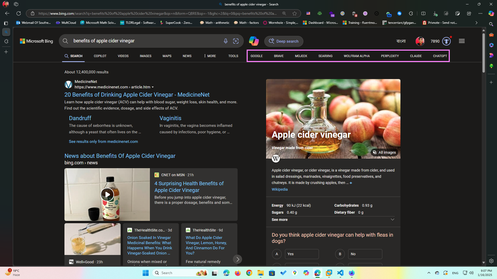

# BingEnhancer

Do you want to keep Bing as your default search engine but sometimes you need other's? This open source extension adds buttons to quickly search using other search engines such as Google, Brave, Mojeek and SearXNG.

## Installation

If you're using Google Chrome then follow this tutorial: <https://youtu.be/rO6Nhwu8uMo>

## FAQs

### Why is Ecosia, DuckDuckGo and Startpage isn't an option?

[DuckDuckGo](https://duckduckgo.com) and [Ecosia](https://www.ecosia.org/) uses [Bing](https://bing.com)'s index.

### Why is Mojeek and Brave is an option?

[Mojeek](https://www.mojeek.com) and [Brave](https://search.brave.com) offers independent indexes.

### Why is SearXNG is an option?

[SearXNG](https://github.com/searxng/searxng) is a popular metasearch engine.
